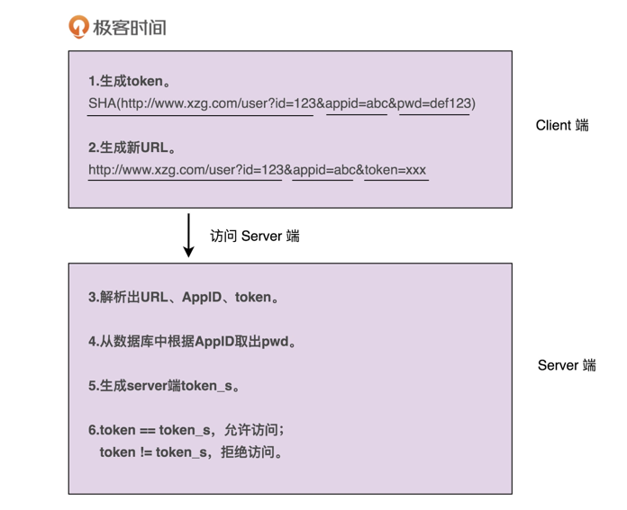
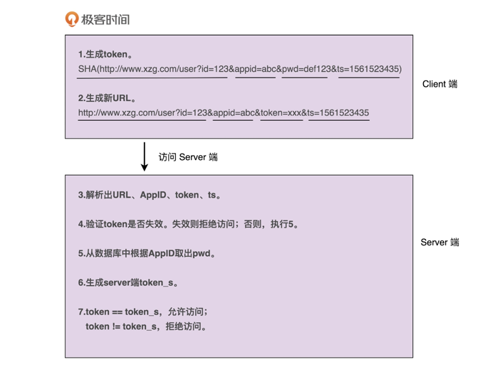

# 分析设计编程实现一个通用的接口鉴权功能
> 案例介绍和难点剖析假设，你正在参与开发一个微服务。微服务通过 HTTP 协议暴露接口给其他系统调用，说直白点就是，其他系统通过 URL 来调用微服务的接口。有一天，你的 leader 找到你说，“为了保证接口调用的安全性，我们希望设计实现一个接口调用鉴权功能，只有经过认证之后的系统才能调用我们的接口，没有认证过的系统调用我们的接口会被拒绝。我希望由你来负责这个任务的开发，争取尽快上线。”

## 13 | 实战二（上）：如何对接口鉴权这样一个功能开发做面向对象分析 OOA ？

### 一轮分析
对于如何做鉴权这样一个问题，最简单的解决方案就是，通过用户名加密码来做认证。我们给每个允许访问我们服务的调用方，派发一个应用名（或者叫应用 ID、AppID）和一个对应的密码（或者叫秘钥）。调用方每次进行接口请求的时候，都携带自己的 AppID 和密码。微服务在接收到接口调用请求之后，会解析出 AppID 和密码，跟存储在微服务端的 AppID 和密码进行比对。如果一致，说明认证成功，则允许接口调用请求；否则，就拒绝接口调用请求。

### 二轮分析
不过，这样的验证方式，每次都要明文传输密码。密码很容易被截获，是不安全的。那如果我们借助加密算法（比如 SHA），对密码进行加密之后，再传递到微服务端验证，是不是就可以了呢？实际上，这样也是不安全的，因为加密之后的密码及 AppID，照样可以被未认证系统（或者说黑客）截获，未认证系统可以携带这个加密之后的密码以及对应的 AppID，伪装成已认证系统来访问我们的接口。这就是典型的“重放攻击”。

提出问题，然后再解决问题，是一个非常好的迭代优化方法。对于刚刚这个问题，我们可以借助 OAuth 的验证思路来解决。调用方将请求接口的 URL 跟 AppID、密码拼接在一起，然后进行加密，生成一个 token。调用方在进行接口请求的的时候，将这个 token 及 AppID，随 URL 一块传递给微服务端。微服务端接收到这些数据之后，根据 AppID 从数据库中取出对应的密码，并通过同样的 token 生成算法，生成另外一个 token。用这个新生成的 token 跟调用方传递过来的 token 对比。如果一致，则允许接口调用请求；否则，就拒绝接口调用请求。



### 三轮分析
不过，这样的设计仍然存在重放攻击的风险，还是不够安全。每个 URL 拼接上 AppID、密码生成的 token 都是固定的。未认证系统截获 URL、token 和 AppID 之后，还是可以通过重放攻击的方式，伪装成认证系统，调用这个 URL 对应的接口。为了解决这个问题，我们可以进一步优化 token 生成算法，引入一个随机变量，让每次接口请求生成的 token 都不一样。我们可以选择时间戳作为随机变量。原来的 token 是对 URL、AppID、密码三者进行加密生成的，现在我们将 URL、AppID、密码、时间戳四者进行加密来生成 token。调用方在进行接口请求的时候，将 token、AppID、时间戳，随 URL 一并传递给微服务端。微服务端在收到这些数据之后，会验证当前时间戳跟传递过来的时间戳，是否在一定的时间窗口内（比如一分钟）。如果超过一分钟，则判定 token 过期，拒绝接口请求。如果没有超过一分钟，则说明 token 没有过期，就再通过同样的 token 生成算法，在服务端生成新的 token，与调用方传递过来的 token 比对，看是否一致。如果一致，则允许接口调用请求；否则，就拒绝接口调用请求。



### 四轮分析
不过，你可能会说，这样还是不够安全啊。未认证系统还是可以在这一分钟的 token 失效窗口内，通过截获请求、重放请求，来调用我们的接口啊！你说得没错。不过，攻与防之间，本来就没有绝对的安全。我们能做的就是，尽量提高攻击的成本。这个方案虽然还有漏洞，但是实现起来足够简单，而且不会过度影响接口本身的性能（比如响应时间）。所以，权衡安全性、开发成本、对系统性能的影响，这个方案算是比较折中、比较合理的了。实际上，还有一个细节我们没有考虑到，那就是，如何在微服务端存储每个授权调用方的 AppID 和密码。当然，这个问题并不难。最容易想到的方案就是存储到数据库里，比如 MySQL。不过，开发像鉴权这样的非业务功能，最好不要与具体的第三方系统有过度的耦合。针对 AppID 和密码的存储，我们最好能灵活地支持各种不同的存储方式，比如 ZooKeeper、本地配置文件、自研配置中心、MySQL、Redis 等。我们不一定针对每种存储方式都去做代码实现，但起码要留有扩展点，保证系统有足够的灵活性和扩展性，能够在我们切换存储方式的时候，尽可能地减少代码的改动。

### 最终确定需求
到此，需求已经足够细化和具体了。现在，我们按照鉴权的流程，对需求再重新描述一下。如果你熟悉 UML，也可以用时序图、流程图来描述。不过，用什么描述不是重点，描述清楚才是最重要的。考虑到在接下来的面向对象设计环节中，我会基于文字版本的需求描述，来进行类、属性、方法、交互等的设计，所以，这里我给出的最终需求描述是文字版本的。调用方进行接口请求的时候，将 URL、AppID、密码、时间戳拼接在一起，通过加密算法生成 token，并且将 token、AppID、时间戳拼接在 URL 中，一并发送到微服务端。微服务端在接收到调用方的接口请求之后，从请求中拆解出 token、AppID、时间戳。微服务端首先检查传递过来的时间戳跟当前时间，是否在 token 失效时间窗口内。如果已经超过失效时间，那就算接口调用鉴权失败，拒绝接口调用请求。如果 token 验证没有过期失效，微服务端再从自己的存储中，取出 AppID 对应的密码，通过同样的 token 生成算法，生成另外一个 token，与调用方传递过来的 token 进行匹配；如果一致，则鉴权成功，允许接口调用，否则就拒绝接口调用。这就是我们需求分析的整个思考过程，从最粗糙、最模糊的需求开始，通过“提出问题 - 解决问题”的方式，循序渐进地进行优化，最后得到一个足够清晰、可落地的需求描述。

## 14 | 实战二（下）：如何利用面向对象设计和编程开发接口鉴权功能？OOD OOP

### 如何进行面向对象设计？
我们知道，面向对象分析的产出是详细的需求描述，那面向对象设计的产出就是类。在面向对象设计环节，我们将需求描述转化为具体的类的设计。我们把这一设计环节拆解细化一下，主要包含以下几个部分：
- 划分职责进而识别出有哪些类；
- 定义类及其属性和方法；
- 定义类与类之间的交互关系；
- 将类组装起来并提供执行入口。

### 1. 划分职责进而识别出有哪些类

面向对象分析结果贴在了下面。
- 调用方进行接口请求的时候，将 URL、AppID、密码、时间戳拼接在一起，通过加密算法生成 token，并且将 token、AppID、时间戳拼接在 URL 中，一并发送到微服务端。
- 微服务端在接收到调用方的接口请求之后，从请求中拆解出 token、AppID、时间戳。
- 微服务端首先检查传递过来的时间戳跟当前时间，是否在 token 失效时间窗口内。
- 如果已经超过失效时间，那就算接口调用鉴权失败，拒绝接口调用请求。
- 如果 token 验证没有过期失效，微服务端再从自己的存储中，取出 AppID 对应的密码，通过同样的 token 生成算法，生成另外一个 token，与调用方传递过来的 token 进行匹配。如果一致，则鉴权成功，允许接口调用；否则就拒绝接口调用。

首先，我们要做的是逐句阅读上面的需求描述，拆解成小的功能点，一条一条罗列下来。注意，拆解出来的每个功能点要尽可能的小。每个功能点只负责做一件很小的事情（专业叫法是“单一职责”，后面章节中我们会讲到）。下面是我逐句拆解上述需求描述之后，得到的功能点列表：
1. 把 URL、AppID、密码、时间戳拼接为一个字符串；
2. 对字符串通过加密算法加密生成 token；
3. 将 token、AppID、时间戳拼接到 URL 中，形成新的 URL；
4. 解析 URL，得到 token、AppID、时间戳等信息；
5. 从存储中取出 AppID 和对应的密码；
6. 根据时间戳判断 token 是否过期失效；
7. 验证两个 token 是否匹配；从上面的功能列表中，

我们发现，1、2、6、7 都是跟 token 有关，负责 token 的生成、验证；
3、4 都是在处理 URL，负责 URL 的拼接、解析；
5 是操作 AppID 和密码，负责从存储中读取 AppID 和密码。
所以，我们可以粗略地得到三个核心的类：AuthToken、Url、CredentialStorage。
AuthToken 负责实现 1、2、6、7 这四个操作；Url 负责 3、4 两个操作；CredentialStorage 负责 5 这个操作。

虽然需求描述中，我们都是以 URL 来代指接口请求，但是，接口请求并不一定是以 URL 的形式来表达，还有可能是 Dubbo、RPC 等其他形式。为了让这个类更加通用，命名更加贴切，我们接下来把它命名为 ApiRequest。下面是我根据功能点描述设计的 ApiRequest 类。

```java
/**
 * ApiRequest. rename to ApiAuthRequest
 *
 * @author huwenfeng
 */
@Data
public class ApiAuthRequest {

    private String baseUrl;
    private String token;
    private String appId;
    private long timestamp;

    public ApiAuthRequest() {
    }

    public ApiAuthRequest(String baseUrl, String token, String appId, long timestamp) {
        this.baseUrl = baseUrl;
        this.token = token;
        this.appId = appId;
        this.timestamp = timestamp;
    }
}
```


### 演示结果 

#### 访问成功示例
```shell
http://localhost:8080/api/one?token=756f63cfb15f53eb877f548dd65cf4c9&appId=testAppId&timestamp=1699260270483&baseUrl=/api/one
```
响应:
```json
{
    "code": "200",
    "message": "成功",
    "data": true,
    "success": true
}
```

#### 访问过期的token时
```shell
http://localhost:8080/api/one?token=756f63cfb15f53eb877f548dd65cf4c9&appId=testAppId&timestamp=1699260270483&baseUrl=/api/one
```

```json
{
    "code": "500",
    "message": "Token is expired.",
    "success": false
}
```


## 
关联文章：
> https://time.geekbang.org/column/article/171760

> https://time.geekbang.org/column/article/171767
