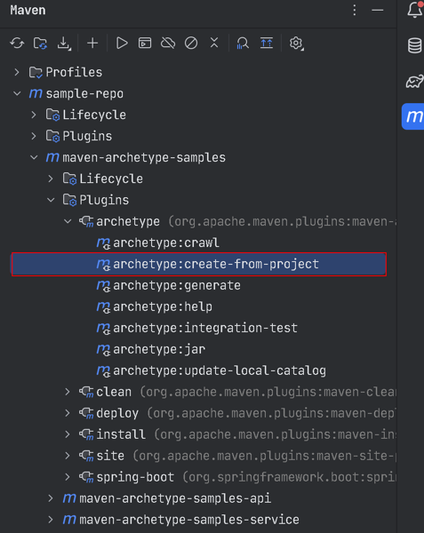
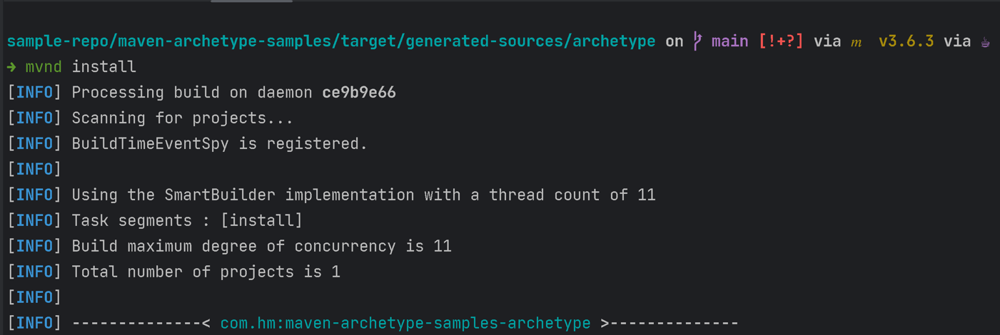
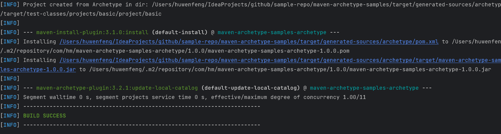
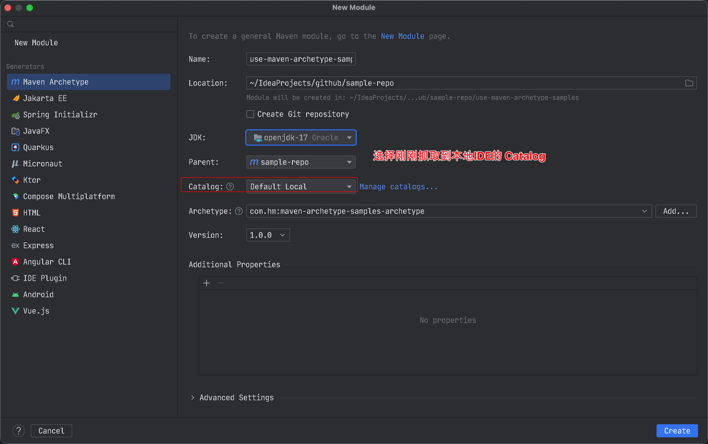

# maven-archetype-sample

## Usage
> https://maven.apache.org/archetype/maven-archetype-plugin/
> 
> https://maven.apache.org/archetype/maven-archetype-plugin/advanced-usage.html

## Quick Start

- 创建要作为骨架的项目（根据自己项目需求来）当前这个项目就可以作为一个骨架（模板）项目
- 项目中引入Maven Archetype 插件
  ```xml
  <plugin>
      <groupId>org.apache.maven.plugins</groupId>
      <artifactId>maven-archetype-plugin</artifactId>
      <version>3.2.1</version>
  </plugin>
  ```
- 执行：`mvn archetype:create-from-project` 
  - 
- 找到当前骨架项目 `target\generated-sources\archetype` 目录 执行 `mvn install` ;安装到本地仓库
  - 
  - 
- 使用我们刚刚创建的骨架
  - 将安装好的骨架添加到IDE中: 执行 `mvn archetype:crawl`
  - 创建项目方式1：使用IDE创建项目  
    - 
  - 创建项目方式2：使用交互式命令创建项目 `mvn archetype:generate -DarchetypeCatalog=local`

## Tips
- 骨架项目项目命名注意：多模块项目 子模块名要和父模块名的前置保持一致；例：父项目：`user` 子模块命名要以 `user-xxx`（xxx为业务模块名）
- 骨架项目包名命名注意：`groupId`.xxx (xxx为业务模块名)  例：当`groupId`为`com.hm`且xxx为api时 包名则为 `com.hm.api`
- 骨架项目中空目录需要站位：一般我习惯用 `.gitkeep` 文件来站位；具体看个人喜好。