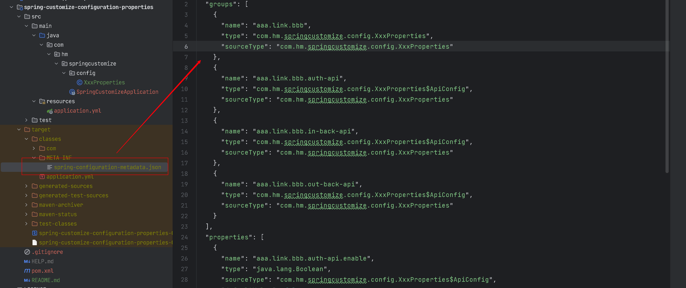

# SpringBoot 自定义属性使用

## Usage
> @Component
```java
@Component
@ConfigurationProperties(prefix = "xxx")
public class XxxProperties {
    // ...
}
```
优劣：@Component 很明确的加入了Spring容器中、但是每个自定义属性都要标明；

> @ConfigurationPropertiesScan
```java

@ConfigurationPropertiesScan({"com.hm"})
@ConfigurationProperties(prefix = "xxx")
public class XxxProperties {
    // ...
}
```
优劣：仅需要定义 扫描一次，启动可能会稍慢一些；

> @EnableConfigurationProperties
```java

@EnableConfigurationProperties(value = XxxProperties.class)
@ConfigurationProperties(prefix = "xxx")
public class XxxProperties {
    // ...
}
```
优劣：配置属性使用较为明确，单每次新加一个属性都需要去开启。

> tips：建议每个项目仅有一个唯一的一个根前缀！！！

## 自定义属性提示

添加依赖：

```xml
<dependency>
    <groupId>org.springframework.boot</groupId>
    <artifactId>spring-boot-configuration-processor</artifactId>
    <optional>true</optional>
</dependency>
```

执行：`mvn clean package` 生成如下内容， yml中自定义属性提示就有了。
